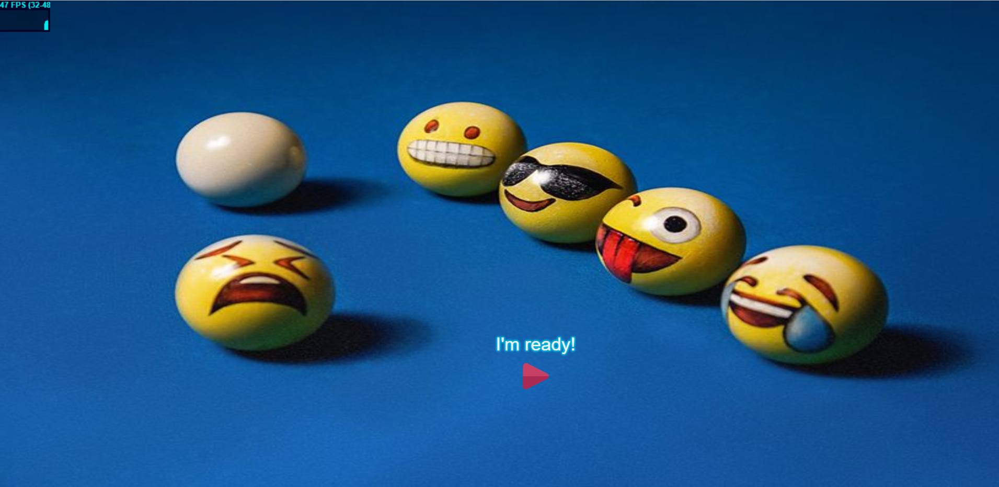
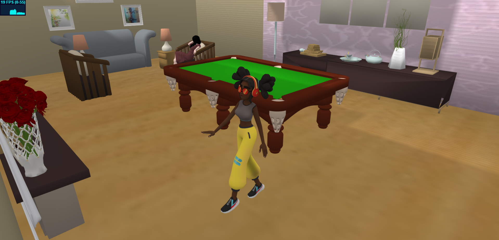
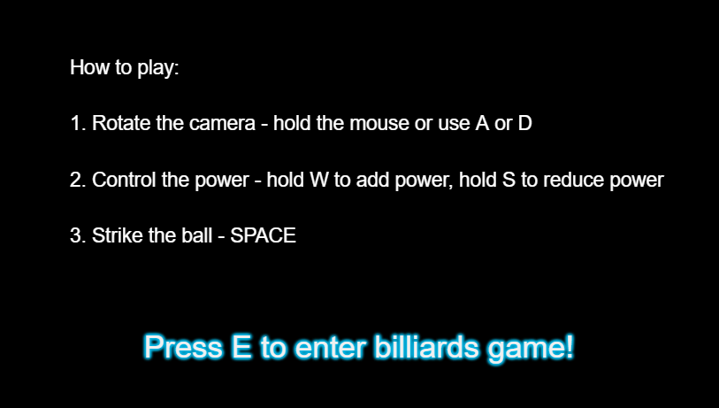
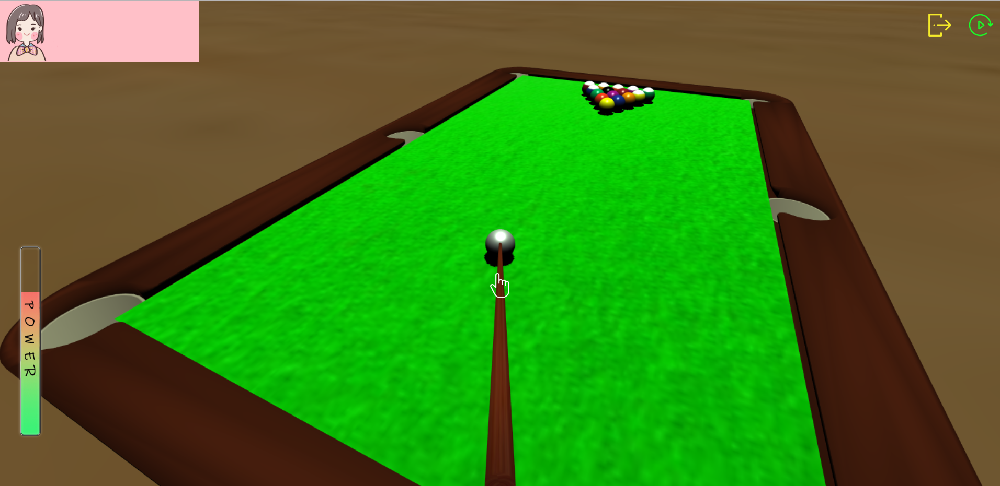
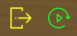

# VR-Billiards-Threejs

**VR project by our group in 2019**  
*@author zry wzy jcx hal wtn*

Try Demo [here](https://zhgruiyi.github.io/VR-Billiards-Threejs/).
## Introduction
It's a virtual billiards studio.  

## Hang around in the room
* -Click to start and you will enter a room. You can use WSAD to hang around.   

* -If you want to play the billiards, you need to walk to the table and there will be a  `on the top right` of the interface. 
## Enjoy the game
There is a 3D billiard game with all the real rules with two players playing against each other.  

Here  you can choose to restart the game or exit.

---

Now enjoy it yourself in our 3D billiards game!

> hint: it may be **slow** for it has to wait for the models to load!

